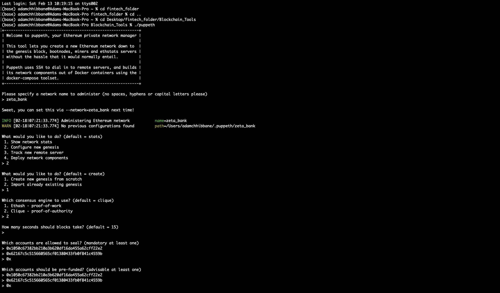

## ZetaBank TestNet PoA Blockchain Setup

###  1: Create Accounts and Nodes

* First, go to the tools folder we titled "Blockchain_Tools", and create two nodes for the network with a separate `datadir` using `geth` input:

        * ./geth --datadir zeta_banknode1 account new
        * ./geth --datadir zeta_banknode2 account new
       
       
   
        
* Second, generate the genesis block.

    * Run `puppeth`, name your network, and select the option to configure a new genesis block (2).
    
    * At the next prompt, select 'Create new genesis from scratch' (1)

    * Choose the `Clique (Proof of Authority)` consensus algorithm.
    
    * At 'How many seconds should blocks take? (default = 15)', press Enter to pass to the next prompt.

    * Paste both account addresses from the first step one at a time into the list of accounts to seal.

    * Paste them again in the list of accounts to pre-fund. There are no block rewards in PoA, so you'll need to pre-fund.

    * You can choose `no` for pre-funding the pre-compiled accounts (0x1 .. 0xff) with wei. This keeps the genesis cleaner.

    * Complete the rest of the prompts, and when you are back at the main menu, choose the "Manage existing genesis" option.
    
    
     
   * Export genesis configurations. This will fail to create two of the files, but you only need `networkname.json`.
   
    
    

* With the genesis block creation completed, we will now initialize the nodes with the genesis' json file.

    * Using `geth`, initialize each node with the new `networkname.json`.
        * ./geth --datadir node1 init networkname.json
        * ./geth --datadir node2 init networkname.json

## 2 Set Nodes to Mine
     
* Now the nodes can be used to begin mining blocks.

    * Run the nodes in separate terminal windows with the commands:
        *  ./geth --datadir node1 --unlock "SEALER_ONE_ADDRESS" --mine --rpc --allow-insecure-unlock
        
        
      
   * Running the first node, locate the enode which will be needed to run the second node.     
      
      
      
        *  ./geth --datadir node2 --unlock "SEALER_TWO_ADDRESS" --mine --port 30304 --bootnodes "enode://SEALER_ONE_ENODE_ADDRESS@127.0.0.1:30303" --ipcdisable --allow-insecure-unlock
      
      
   
   * **NOTE:** Type your password and hit enter - even if you can't see it visually!
   
   * To confirm your blockchain is up and running, check each terminal to see each has the prompt "Confirm new mining work"
   
   
   
    
   

* With both nodes up and running, the blockchain can be added to MyCrypto for testing.

    * Open the MyCrypto app, then click `Change Network` at the bottom left:

    

    * Click "Add Custom Node", then add the custom network information that you set in the genesis.

    * Make sure that you scroll down to choose `Custom` in the "Network" column to reveal more options like `Chain ID`. **Ignore the two prompts highlighted in red; had to re-enter for screenshot :)**

    

    * Type `ETH` in the Currency box.
    
    * In the Chain ID box, type the chain id you generated during genesis creation. The ChainId can easily referenced at the top of your .json file.
    
    

    * In the URL box type: `http://127.0.0.1:8545`.  This points to the default RPC port on your local machine.

    * Finally, click `Save & Use Custom Node`. 
    
* After connecting to the custom network in MyCrypto, it can be tested by sending money between accounts.

    * Select the `View & Send` option from the left menu pane, then click `Keystore file`.

    

    * On the next screen, click `Select Wallet File`, then navigate to the keystore directory inside your Node1 directory, select the file located there, provide your password when prompted and then click `Unlock`.

    * This will open your account wallet inside MyCrypto. 
    
    
    
    * In the `To Address` box, type the account address from Node2, then fill in an arbitrary amount of ETH:

     

    * Confirm the transaction by clicking "Send Transaction", and the "Send" button in the pop-up window.  
    
    * Click the `Check TX Status` when the green message pops up, confirm the logout:

    

    * You should see the transaction go from `Pending` to `Successful` in around the same blocktime you set in the genesis.

    * You can click the `Check TX Status` button to update the status.

    

**Congratulations, you successfully created your own private blockchain!**